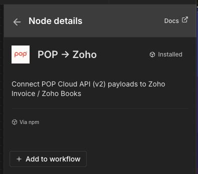
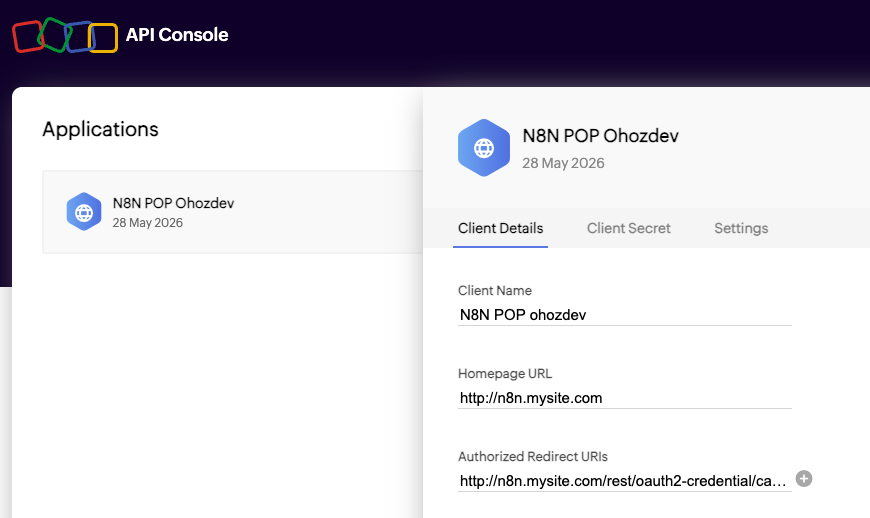
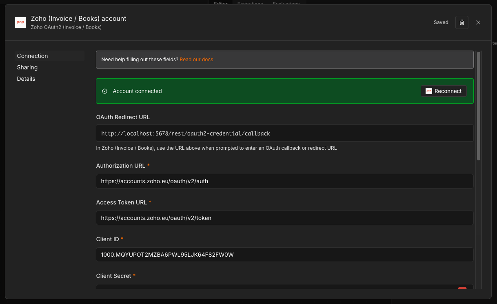
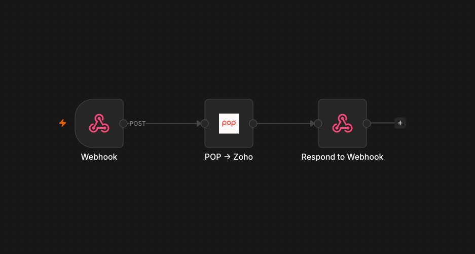
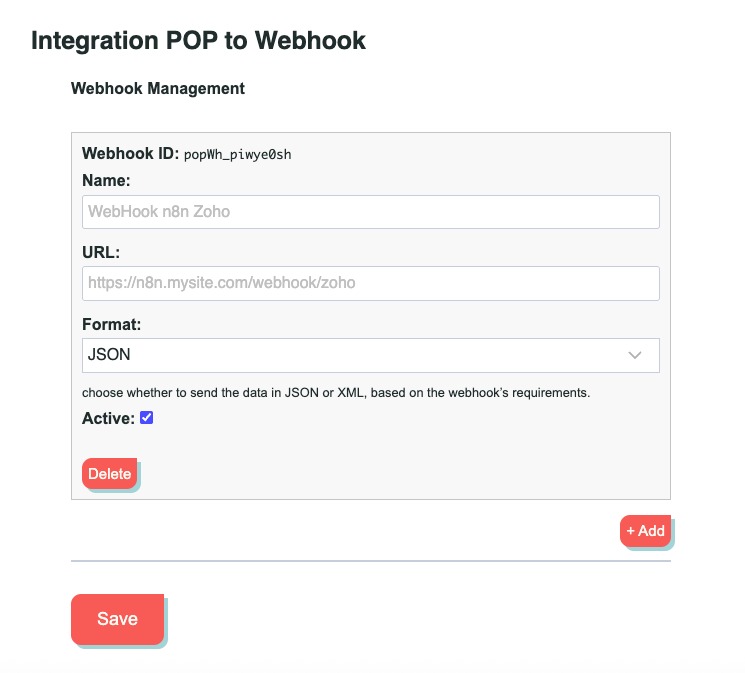
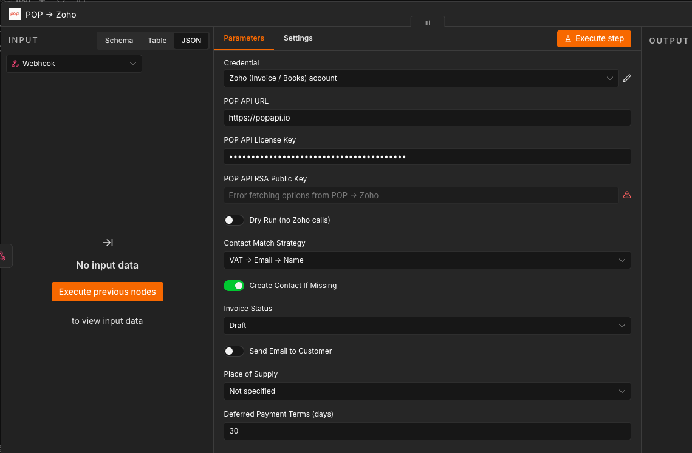

# n8n-nodes-pop-zoho


An n8n community node that receives a [POP API](https://popapi.io) payload and automatically creates the corresponding document in **Zoho Invoice** or **Zoho Books**.

Supported document types:
- `TD01` → Invoice (`POST /invoices`)
- `TD04` → Credit Note (`POST /creditnotes`)



---

## Table of Contents

- [How It Works](#how-it-works)
- [Prerequisites](#prerequisites)
- [Installation](#installation)
- [Credentials Setup](#credentials-setup)
- [Workflow Setup](#workflow-setup)
- [Node Parameters](#node-parameters)
- [Calling the Connector via POP API](#calling-the-connector-via-pop-api)
- [Security Model](#security-model)
- [Error Codes](#error-codes)
- [Sandbox / Dry Run Mode](#sandbox--dry-run-mode)
- [Contact Resolution](#contact-resolution)
- [POP Payload Field Mapping](#pop-payload-field-mapping)
- [Known Limitations (v1)](#known-limitations-v1)
- [Development](#development)
- [License](#license)

---

## How It Works

The node sits inside a standard n8n webhook workflow. POP API calls the webhook with a signed payload; the node verifies the request, maps the POP fields to Zoho's data model, resolves or creates the customer contact, and creates the invoice or credit note via Zoho's REST API.

```
POP API ──► Webhook node ──► POP → Zoho ──► Respond to Webhook node
```

POP API handles the entry point (license validation, sandbox/live mode, quota billing). This node owns: signature verification, payload mapping, contact resolution, tax lookup, and Zoho API calls.

---

## Prerequisites

### POP API
- An active [POP API](https://popapi.io) account with a valid license key
- The **n8n Connector** enabled in your POP API account settings
- The n8n webhook URL registered in your POP API webhook panel

### Zoho
- A **Zoho Invoice** or **Zoho Books** account
- An OAuth2 application created in the [Zoho API Console](https://api-console.zoho.com) (or the console for your region)
- **Organization ID** — found in Zoho → Settings → Organization Profile
- **Tax rates** configured in Zoho → Settings → Taxes, one entry per percentage used in your POP payloads (e.g. 22%, 10%, 4%, 0%)

### n8n
- n8n self-hosted (v2.x or later) or n8n Cloud Enterprise (custom nodes required)
- Node.js v18+

---

## Installation

### From npm (recommended)

In your n8n instance go to **Settings → Community Nodes → Install** and enter:

```
n8n-nodes-pop-zoho
```

<!-- SCREENSHOT: n8n Settings > Community Nodes install dialog with the package name entered -->

### Manual / local development

```bash
# Clone the repository
git clone https://github.com/getpopapi/n8n-nodes-pop-zoho.git
cd n8n-nodes-pop-zoho

# Install dependencies and build
npm install
npm run build

# Symlink into n8n custom nodes directory
ln -s $(pwd)/dist/nodes/PopZohoInvoice/PopZohoInvoice.node.js ~/.n8n/custom/PopZohoInvoice.node.js
ln -s $(pwd)/dist/credentials/ZohoInvoiceOAuth2Api.credentials.js ~/.n8n/custom/ZohoInvoiceOAuth2Api.credentials.js
ln -s $(pwd)/dist/nodes/PopZohoInvoice/pop-zoho-invoice.svg ~/.n8n/custom/pop-zoho-invoice.svg

# Restart n8n
n8n start
```

---

## Credentials Setup

### 1. Create the Zoho OAuth2 Application

1. Go to the [Zoho API Console](https://api-console.zoho.com) for your region
2. Create a new **Server-based Application**
3. Set the redirect URI to your n8n OAuth callback URL:
   `https://<your-n8n-instance>/rest/oauth2-credential/callback`
4. Note the **Client ID** and **Client Secret**



### 2. Configure the Credential in n8n

In n8n go to **Credentials → Add Credential → Zoho OAuth2 (Invoice / Books)** and fill in:

| Field | Description |
|-------|-------------|
| **Product** | `Zoho Invoice` or `Zoho Books` — use Books for UAE e-invoicing |
| **Region** | Your Zoho data center (EU, US, IN, AU, JP, CA) |
| **Organization ID** | From Zoho → Settings → Organization Profile |
| **Authorization URL** | Auto-filled based on region — e.g. `https://accounts.zoho.eu/oauth/v2/auth` |
| **Access Token URL** | Same host as Authorization URL, path `/oauth/v2/token` |
| **Client ID** | From your Zoho API Console application |
| **Client Secret** | From your Zoho API Console application |
| **Scope** | Pre-filled with all required scopes — do not change unless you know what you are doing |

Click **Connect** to complete the OAuth2 authorization flow. Zoho will ask you to confirm the requested permissions.



> **Note on scopes:** The pre-filled scope string includes all permissions required for full connector operation: invoices, credit notes, contacts, and settings. If you previously connected with a narrower scope, revoke the authorization from your Zoho account → **Connected Apps**, then reconnect to grant the updated permissions.

---

## Workflow Setup

### Recommended Workflow

```
[Webhook node]
    ↓
[POP → Zoho node]
    ↓
[Respond to Webhook node]
```

1. **Webhook node** — set **Authentication** to `None` (security is handled by the POP → Zoho node via HMAC + RSA JWT). Set **Respond** to `Using 'Respond to Webhook' Node`.
2. **POP → Zoho node** — configure as described below.
3. **Respond to Webhook node** — leave default settings; it will forward the node output as the HTTP response.



### Register the Webhook URL in POP API

Copy the **Production URL** from the Webhook node (e.g. `https://your-n8n.example.com/webhook/zoho`) and paste it into your POP API account → **Webhooks** panel. Note the **webhook ID** (e.g. `popWh_xxxxxxxx`) — you will need it in every API call.



---

## Node Parameters

### Security

| Parameter | Description |
|-----------|-------------|
| **POP API URL** | Base URL of your POP API instance (default: `https://popapi.io`). Used to auto-fetch the RSA public key. |
| **POP API License Key** | Your POP API license key. Used to verify the HMAC signature on every incoming request. |
| **POP API RSA Public Key** | Click the **Refresh** button to auto-fetch the public key from your POP API instance. Required for RSA JWT verification. |



> **How to get the RSA Public Key:** Set the **POP API URL** field, then click the refresh icon (🔄) next to **POP API RSA Public Key**. The key is fetched automatically from your POP API instance. You only need to do this once per credential setup (or after a key rotation on the POP API server).

### Zoho Behavior

| Parameter | Default | Description |
|-----------|---------|-------------|
| **Contact Match Strategy** | `VAT → Email → Name` | How to find an existing Zoho contact for the invoice customer. |
| **Create Contact If Missing** | `true` | Automatically create the contact in Zoho when no match is found. |
| **Invoice Status** | `Draft` | Status to set on the created invoice in Zoho (`Draft` or `Sent`). |
| **Send Email to Customer** | `false` | Trigger Zoho's built-in invoice email to the customer after creation. |
| **Place of Supply** | `Not specified` | Required for UAE e-invoicing — select the emirate. Leave empty for standard invoices. |
| **Deferred Payment Terms (days)** | `30` | Days granted for payment when the payload uses deferred payment terms (`TP02`). |

### Other

| Parameter | Default | Description |
|-----------|---------|-------------|
| **Dry Run** | `false` | Validate the payload and return the Zoho body that would be sent, without making any Zoho API call. Useful for testing field mapping. |

---

## Calling the Connector via POP API

All requests must go through POP API — never call the n8n webhook directly from your application. POP API validates your license, injects the security tokens, and handles billing.

### Request

```
POST https://popapi.io/wp-json/api/v2/connector/zoho

Headers:
  Content-Type: application/json
  X-Api-Key: <your-license-key>
```

### Body

```json
{
  "integration": {
    "use": "n8n-zoho",
    "id": "<webhook-id>"
  },
  "environment": "sandbox",
  "data": {
    "invoice_body": {
      "general_data": {
        "doc_type": "TD01",
        "date": "2026-03-04",
        "invoice_number": "2026/0001",
        "currency": "EUR"
      }
    },
    "transferee_client": {
      "personal_data": {
        "company_name": "Cliente Test SRL",
        "email": "cliente@example.com",
        "tax_id_vat": {
          "id_code": "12345678901",
          "country_id": "IT"
        },
        "tax_id_code": "RSSMRA80A01H501U"
      },
      "place": {
        "address": "Via Milano 10",
        "city": "Milano",
        "zip_code": "20100",
        "province_id": "MI",
        "country_id": "IT"
      }
    },
    "order_items": [
      {
        "description": "Servizio consulenza",
        "quantity": "1.00",
        "unit_price": "100.00",
        "rate": "22.00",
        "unit": "N.",
        "item_code": { "type": "SKU", "value": "PROD-001" },
        "discount_percent": "",
        "discount_amount": ""
      }
    ],
    "payment_data": {
      "terms_payment": "TP02",
      "payment_details": "MP05",
      "payment_amount": "122.00"
    },
    "purchase_order_data": { "id": "#1001", "date": "2026-03-04" },
    "connected_invoice_data": { "id": "", "date": "" }
  }
}
```

| Field | Values | Description |
|-------|--------|-------------|
| `integration.id` | your webhook ID | The webhook ID registered in your POP API account |
| `environment` | `sandbox` / `live` | `sandbox` runs a dry-run — no Zoho calls, no quota deducted |
| `data.invoice_body.general_data.doc_type` | `TD01` / `TD04` | Document type: `TD01` = invoice, `TD04` = credit note |

For `TD04` credit notes, include `connected_invoice_data.id` with the Zoho invoice ID of the document being reversed.

### Successful Response

```json
{
  "success": true,
  "environment": "live",
  "connector": "zoho",
  "data": {
    "success": true,
    "zoho_product": "books",
    "zoho_document_type": "invoice",
    "zoho_invoice_id": "994269000000070002",
    "zoho_invoice_number": "INV-000001",
    "zoho_status": "draft",
    "zoho_total": 1220.00,
    "contact_id": "994269000000062001",
    "contact_created": false
  }
}
```

---

## Security Model

Every request from POP API to the n8n connector is protected by two independent verification layers:

### 1. HMAC-SHA256 (license key binding)
POP API computes `HMAC-SHA256(body + timestamp, license_key)` and sends it in the `X-POP-Signature` header. The node verifies the signature using the license key configured in the node parameters. This proves the payload belongs to the customer who owns that license key.

### 2. RSA JWT (POP API origin proof)
POP API signs a short-lived JWT (5 min TTL) with its RSA-2048 private key and injects it as `_pop_jwt` in the payload. The node verifies the JWT using the public key fetched from your POP API instance. This proves the request originated from POP API servers — a stolen license key alone is not enough to forge requests.

Both checks are **always mandatory** and cannot be disabled.

---

## Error Codes

| Code | Cause | Fix |
|------|-------|-----|
| `auth_error` | Invalid HMAC signature, expired JWT, or missing security headers | Ensure requests always go through POP API — never call n8n directly |
| `config_error` | License Key or RSA Public Key not set in node parameters | Configure the node parameters and refresh the public key |
| `validation_error` | Required POP field missing in the payload | Check that `data.invoice_body.general_data.*`, `data.transferee_client.*`, and `data.order_items` are all present |
| `unsupported_doc_type` | `doc_type` is not `TD01` or `TD04` | Only `TD01` (invoice) and `TD04` (credit note) are supported in v1 |
| `tax_not_found` | A tax rate in `order_items[].rate` is not configured in Zoho | Go to Zoho → Settings → Taxes and add the missing rate |
| `contact_not_found` | Customer not found in Zoho and **Create Contact If Missing** is disabled | Enable the option or create the contact manually in Zoho |
| `contact_ambiguous` | Multiple Zoho contacts match the same VAT, email, or name | Resolve the duplicate contacts in Zoho before retrying |
| `contact_creation_failed` | Zoho refused the contact creation request | Check the Zoho error details in the n8n execution log |
| `zoho_api_error` | Generic Zoho API error | Check the Zoho error details in the n8n execution log |

---

## Sandbox / Dry Run Mode

Two independent mechanisms to avoid creating real documents during testing:

- **`environment: "sandbox"`** in the POP API request body — POP API injects `_pop_dry_run: true` into the payload (HMAC-signed, cannot be spoofed). No quota is deducted.
- **Dry Run** parameter on the node — skips Zoho API calls regardless of the `_pop_dry_run` flag. Useful for local development without Zoho credentials.

When dry run is active, the response includes `dry_run: true` and the full `zoho_body` that would have been sent to Zoho, allowing you to verify the field mapping.

---

## Contact Resolution

The node searches for an existing Zoho contact before creating a new one, using the strategy configured in **Contact Match Strategy**:

1. **VAT → Email → Name** *(default)*: searches by VAT/TRN code first, then email address, then company/person name
2. **Email → Name**: skips the VAT lookup (useful if VAT codes are not stored in Zoho)

If multiple contacts match, the node returns a `contact_ambiguous` error — resolve the duplicate in Zoho and retry.

If no contact is found and **Create Contact If Missing** is enabled, the node creates a new contact using the `transferee_client` data from the payload, including billing address and VAT treatment for UAE/GCC accounts.

---

## POP Payload Field Mapping

| POP field | Zoho field |
|-----------|-----------|
| `invoice_body.general_data.date` | `date` |
| `invoice_body.general_data.currency` | `currency_code` |
| `invoice_body.general_data.invoice_number` | (informational — Zoho auto-assigns) |
| `transferee_client.*` | contact lookup / creation |
| `order_items[].description` | `line_items[].name` |
| `order_items[].unit_price` | `line_items[].rate` |
| `order_items[].quantity` | `line_items[].quantity` |
| `order_items[].rate` | tax lookup by percentage → `line_items[].tax_id` |
| `order_items[].discount_percent` | `line_items[].discount` (percentage only) |
| `purchase_order_data.id` | `reference_number` |
| `payment_data.terms_payment` | `payment_terms` (days) |
| `connected_invoice_data.id` | `reference_invoice_id` (TD04 only) |

---

## Known Limitations (v1)

- **Line discount precision** — Zoho line items only accept percentage discounts. When the POP payload provides an absolute `discount_amount`, the node converts it to a percentage using `discount_amount / unit_price × 100`. Rounding may produce a small discrepancy (< 0.01%) on the Zoho total.
- **Contact updates** — when an existing contact is found in Zoho, its fields are not updated even if they differ from the POP payload. Update the contact manually in Zoho if needed.

---

## Development

```bash
npm install          # install dependencies
npx tsc --noEmit     # type check only
npm run build        # compile to dist/
npm run dev          # watch mode
```

---

## License

MIT — see [LICENSE](LICENSE.md)

---

## Related

- [n8n-nodes-pop](https://github.com/getpopapi/n8n-nodes-pop) — POP API node for n8n (FatturaPA, Peppol, VAT validation)
- [POP API Documentation](https://www.postman.com/pop-cloud/pop-cloud-api/overview)
